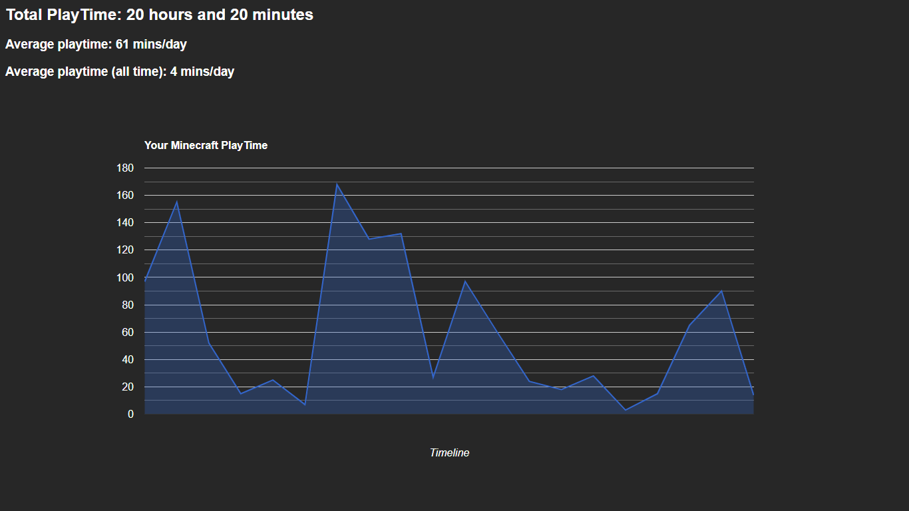

# Minecraft PlayTime

This web-app shows you how many hours you spent playing Minecraft JavaEdition

## Everything you need to know

1. **Before we start**

   - You will need [NodeJS & NPM](https://nodejs.org/en/download/package-manager/current) installed on your computer.

2. **How to use**

**_NOTE:_**  ```hello```

   - On your terminal locate the folder
     ```terminal
     cd Minecraft-PlayTime
     ```
   - Run the file
     ```terminal
     node server.js
     ```
   - Open the web-server on
     ```terminal
     http://localhost:3000
     ```
     and refresh the website

3. **More info**

   - **Total PlayTime** shows the total time you spent playing Minecraft
   - **Average PlayTime** shows yout average playtime, _collected through all log files_
   - **Average PlayTime (all time)** shows your average playtime, _including the days you didn't log in_

   
